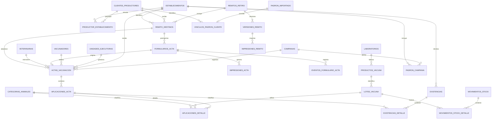

# Modelo de datos propuesto — borrador inicial

## Alcance

Este borrador traduce el relevamiento de Microsoft Access a un modelo conceptual nuevo. No es todavía un esquema físico ni una migración. Se basa en evidencia confirmada de tablas, relaciones y formularios, y marca las decisiones que todavía requieren validación operativa.

El objetivo es soportar campañas de vacunación antiaftosa, conservar el componente de brucelosis en terneras cuando corresponda, controlar stock por lote y mantener historia auditable.

## Núcleo recomendado

| Área | Tabla propuesta | Responsabilidad principal |
|---|---|---|
| Campañas | `campanias` | Año, tipo total/parcial, fechas, estado y reglas de población objetivo. |
| Campañas | `periodos_campania` | Semanas o cortes administrativos propios de una campaña. |
| Personas | `clientes_productores` | Identidad canónica, documento, contacto y datos comerciales del cliente/productor utilizado para facturación y operación. |
| Predios | `establecimientos` | RENSPA, nombre, ubicación y atributos estables del predio. |
| Predios | `productor_establecimiento` | Rol o régimen del productor en el predio y su vigencia. |
| Predios | `explotaciones_establecimiento` | Actividades como cría, tambo o invernada, con vigencia. |
| Existencias | `existencias` | Cabecera de una declaración o fotografía de rodeo por fecha, campaña y fuente. |
| Existencias | `existencias_detalle` | Cantidad por categoría animal. |
| Catálogos | `categorias_animales` | Vacas, vaquillonas, terneros, terneras, búfalos, etc. |
| Organización | `unidades_ejecutoras` | UEL responsable de stock, distribución y actas. |
| Personas | `vacunadores` | Persona habilitada, matrícula, tipo veterinario/idóneo y vigencia. |
| Organización | `veterinarias` | Veterinaria o punto operativo asociado al acta. |
| Comercial | `empresas` | Empresa láctea, cooperativa u organización receptora. |
| Comercial | `establecimiento_empresa` | Relación comercial del establecimiento con vigencia. |
| Vacunas | `laboratorios` | Fabricante o laboratorio. |
| Vacunas | `productos_vacuna` | Vacuna antiaftosa, marca y fabricante; queda preparado para futuros productos. |
| Vacunas | `lotes_vacuna` | Serie/lote, vencimiento, producto y estado. |
| Stock | `ubicaciones_stock` | UEL o profesional que mantiene la custodia física. |
| Stock | `stock_veterinaria` | Propiedad de frascos llenos por veterinaria, UEL, lote y condición. |
| Stock | `movimientos_stock` | Recepción, transferencia, devolución, consumo, rotura/decomiso en UEL o ajuste. |
| Stock | `movimientos_stock_detalle` | Veterinaria propietaria, lote, cantidad de frascos o remanente y condición. |
| Stock | `remitos_retiro` | Autorización, entrega y firma del profesional que retira desde la UEL. |
| Stock | `remitos_retiro_detalle` | Serie/lote y cantidad de frascos llenos entregados. |
| Stock | `remito_destinos` | Uno o más clientes/productores y establecimientos previstos para utilizar la vacuna de un remito. |
| Stock | `versiones_remito` | Instantánea de cada emisión o modificación, con número de versión, motivo y estado de firma. |
| Stock | `impresiones_remito` | Fecha, usuario, versión impresa y reimpresiones del comprobante. |
| Stock | `sobrantes_vacuna` | Remanente abierto por veterinaria, lote, productor, establecimiento y acta. |
| Stock | `conciliaciones_remito` | Retirado, suma vacunada, devoluciones, diferencia y estado de cierre. |
| Documentos | `series_acta` | Secuencias y rangos autorizados para numerar formularios. |
| Documentos | `lotes_impresion_acta` | Emisión de juegos numerados y control de rangos impresos. |
| Documentos | `formularios_acta` | Papel numerado, datos preimpresos, asignación y estado documental. |
| Documentos | `impresiones_acta` | Original, duplicado, triplicado y reimpresiones. |
| Documentos | `eventos_formulario_acta` | Entrega, devolución, extravío, anulación y demás trazabilidad física. |
| Vacunación | `actas_vacunacion` | Cabecera: campaña, establecimiento, fecha, número, UEL, vacunador y estado. |
| Vacunación | `aplicaciones_acta` | Programa/enfermedad, resultado o razón y cantidades de la intervención. |
| Vacunación | `aplicaciones_detalle` | Categoría animal, animales vacunados, lote y dosis utilizadas. |
| Vacunación | `rectificaciones_acta` | Correcciones posteriores a la confirmación y sus efectos auditados. |
| Padrón | `importaciones_padron` | Fuente, fecha, campaña, archivo y responsable de una importación SENASA. |
| Padrón | `padron_importado` | Filas originales de cada importación. |
| Padrón | `vinculos_padron_cliente` | Correspondencia obligatoria y trazable entre cada fila SENASA operativa y el cliente/productor canónico. |
| Padrón | `padron_campania` | Población esperada conciliada para una campaña. |
| Sanidad | `eventos_sanitarios` | Evento de muestreo o control, enfermedad, establecimiento y profesional. |
| Sanidad | `protocolos_laboratorio` | Laboratorio, protocolo, muestras y estado. |
| Sanidad | `resultados_laboratorio` | Resultado por prueba o muestra. |
| Geografía | `provincias`, `departamentos`, `localidades` | Jerarquía territorial normalizada con códigos históricos. |
| Auditoría | `auditoria_cambios` | Usuario, fecha, acción y valores relevantes de cambios sensibles. |
| Seguridad | `usuarios` | Identidad de acceso, estado y datos mínimos de autenticación. |
| Seguridad | `roles` y `permisos` | Acciones autorizadas con denegación por defecto. |
| Seguridad | `usuario_campania` | Alcance del coordinador por campaña, UEL, vigencia y permisos adicionales. |

## Relación central

## Decisiones clave del rediseño

### Acta única con aplicaciones por programa

VACUNA y VACUNABT tienen estructuras paralelas y pueden compartir establecimiento, fecha, acta, UEL y vacunador. Se propone una cabecera única de acta y líneas de aplicación por programa o enfermedad. Esto evita duplicar identidad y permite que una misma visita registre aftosa y brucelosis cuando corresponda.

La aplicación debe guardar explícitamente el resultado: vacunado, sin existencia de terneras, criterio profesional, sin datos u otro catálogo vigente. La cantidad vacunada no reemplaza al resultado.

### Formulario físico separado del acta digital

El número impreso pertenece al formulario físico y queda ocupado desde su emisión, incluso si el documento se anula, extravía o nunca produce una vacunación. El acta digital aparece cuando se transcriben los datos de campo. Esta separación evita registrar vacunaciones ficticias para controlar papel numerado y permite auditar entrega, devolución y reimpresión.

Cada destino confirmado de un remito puede originar un `formulario_acta` preimpreso, mostrado al usuario como preborrador. El formulario conserva el vínculo con `remito_destinos`; generarlo, imprimirlo o entregarlo no crea consumo ni cobertura. Cuando regresa completado, origina o completa la `acta_vacunacion` correspondiente.

### Existencias separadas de animales vacunados

Las cantidades de ESTABLECIMIENTOS representan un padrón o fotografía del rodeo. Los animales efectivamente vacunados pertenecen al detalle del acta. Mezclarlos impediría reconstruir cobertura histórica.

### Stock como movimientos por lote

DISTRUBUCION y DISTRI-VETE se reemplazan conceptualmente por movimientos con origen, destino y lote. La recepción agrega stock; la entrega al vacunador lo transfiere; la aplicación lo consume; las devoluciones, las roturas/decomisos en UEL y los ajustes autorizados generan movimientos propios. No se edita un saldo manual.

En la operación actual las veterinarias son propietarias de la vacuna y la UEL mantiene su custodia física y administración. El stock debe separarse simultáneamente por veterinaria, serie/lote y condición. Los retiros se documentan mediante remitos firmados y los sobrantes de frascos abiertos se mantienen separados de los frascos llenos, vinculados al productor, establecimiento y acta de origen.

Un remito puede indicar varios productores/establecimientos de destino. Cada acta consume una parte del retiro para uno de esos destinos y la conciliación suma todas las actas confirmadas y vigentes. Las roturas y los decomisos son bajas exclusivas del stock físico de la UEL y no integran la conciliación de un remito entregado.

Si se agrega un destino después de la entrega, el mismo remito genera una nueva versión completa, se imprime nuevamente y requiere otra firma del profesional. La versión anterior y su firma permanecen inmutables para auditoría.

### Historia de responsables y empresas

Propietario, régimen y empresa comercial pueden cambiar. Las tablas de vínculo conservarán fechas desde/hasta y evitarán sobrescribir la relación histórica usada en campañas anteriores.

### Padrón versionado por campaña

Cada archivo o consulta SENASA se conserva como una importación identificada. La conciliación produce el padrón operativo de campaña sin perder filas originales ni decisiones manuales. Así los informes de «no vacunaron» siguen siendo reproducibles.

El cliente/productor canónico es el maestro utilizado para facturación y puede provenir de una importación o de un alta manual. Cada fila SENASA que participe del flujo debe vincularse directamente con uno de estos clientes. Un cliente puede tener varios establecimientos, RENSPA o registros históricos, pero una fila SENASA operativa no puede apuntar simultáneamente a dos clientes activos.

## Reglas iniciales sugeridas

- RENSPA y documentos se almacenan como texto normalizado, conservando el valor original de importación.
- Una acta no se elimina físicamente: se anula con motivo, fecha y usuario.
- El número de acta requiere una regla de unicidad cuyo ámbito debe definirse: campaña, UEL, talonario u otro.
- Un lote usa identificador textual y fecha de vencimiento; admite letras y ceros iniciales.
- Toda cantidad incluye unidad y debe ser no negativa; los ajustes negativos se expresan por el tipo/dirección del movimiento.
- Los catálogos admiten vigencia para preservar valores históricos sin seguir ofreciéndolos en nuevas cargas.
- Los estados «Sin Datos», «Libre» y «En Saneamiento» son distintos y no se convierten entre sí.
- Las fechas administrativas de campaña y períodos se validan contra superposiciones.
- Los metadatos de auditoría —usuarios, fechas, acciones y valores históricos sensibles— no se imprimen ni aparecen en vistas operativas comunes; quedan restringidos a permisos administrativos o de auditoría.

## Equivalencias principales con Access

| Origen Access | Destino conceptual |
|---|---|
| ESTABLECIMIENTOS | establecimientos, clientes_productores, vínculos, explotaciones y existencias |
| EMPRESA | empresas + establecimiento_empresa |
| TABGEO | departamentos/localidades con códigos históricos |
| UEL | unidades_ejecutoras |
| VACUNADOR | vacunadores |
| Veterinarias | veterinarias |
| LABORATORIO | laboratorios |
| DISTRUBUCION | recepción/movimiento de stock por lote |
| DISTRI-VETE | transferencia de stock a vacunador |
| VACUNA | acta/aplicación de aftosa y consumo de vacuna |
| VACUNABT | aplicación o resultado de brucelosis en terneras |
| senasa | importación, vínculo con cliente/productor canónico y padrón de campaña |
| EPIDEMIA | eventos y resultados sanitarios |
| semanas | períodos administrativos de campaña |

## Decisiones pendientes antes del esquema físico

1. Alcance de la primera versión: solo aftosa o también brucelosis y controles sanitarios.
2. Definición oficial de campaña total/parcial y categorías obligatorias.
3. Unidad de stock y relación entre frascos, presentaciones y dosis.
4. Regla sanitaria para reutilización o descarte de sobrantes abiertos.
5. Significado exacto de Fecha Recep, Fgarrapata, Presencia, Cantidadp y resultado S.
6. Fuente vigente del padrón SENASA y reglas de conciliación.
7. Tecnología de implementación y operación con o sin conectividad.

## Tema postergado

El ámbito de unicidad, la administración de rangos y la continuidad de la numeración de actas se definirán en una etapa futura.
