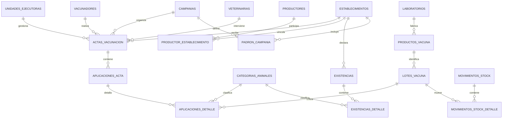

# Modelo de datos propuesto — borrador inicial

## Alcance

Este borrador traduce el relevamiento de Microsoft Access a un modelo conceptual nuevo. No es todavía un esquema físico ni una migración. Se basa en evidencia confirmada de tablas, relaciones y formularios, y marca las decisiones que todavía requieren validación operativa.

El objetivo es soportar campañas de vacunación antiaftosa, conservar el componente de brucelosis en terneras cuando corresponda, controlar stock por lote y mantener historia auditable.

## Núcleo recomendado

| Área | Tabla propuesta | Responsabilidad principal |
|---|---|---|
| Campañas | `campanias` | Año, tipo total/parcial, fechas, estado y reglas de población objetivo. |
| Campañas | `periodos_campania` | Semanas o cortes administrativos propios de una campaña. |
| Personas | `productores` | Identidad, documento y contacto del productor o titular. |
| Predios | `establecimientos` | RENSPA, nombre, ubicación y atributos estables del predio. |
| Predios | `productor_establecimiento` | Rol o régimen del productor en el predio y su vigencia. |
| Predios | `explotaciones_establecimiento` | Actividades como cría, tambo o invernada, con vigencia. |
| Existencias | `existencias` | Cabecera de una declaración o fotografía de rodeo por fecha, campaña y fuente. |
| Existencias | `existencias_detalle` | Cantidad por categoría animal. |
| Catálogos | `categorias_animales` | Vacas, vaquillonas, terneros, terneras, búfalos, etc. |
| Organización | `unidades_ejecutoras` | UEL responsable de stock, distribución y actas. |
| Personas | `vacunadores` | Persona habilitada, matrícula, tipo veterinario/idóneo y vigencia. |
| Organización | `veterinarias` | Veterinaria o punto operativo asociado al acta. |
| Comercial | `empresas` | Empresa láctea, cooperativa u organización receptora. |
| Comercial | `establecimiento_empresa` | Relación comercial del establecimiento con vigencia. |
| Vacunas | `laboratorios` | Fabricante o laboratorio. |
| Vacunas | `productos_vacuna` | Producto, marca, enfermedad, presentación y fabricante. |
| Vacunas | `lotes_vacuna` | Serie/lote, vencimiento, producto y estado. |
| Stock | `ubicaciones_stock` | UEL, vacunador, veterinaria u otra ubicación que mantiene existencias. |
| Stock | `movimientos_stock` | Recepción, transferencia, devolución, pérdida, ajuste o consumo. |
| Stock | `movimientos_stock_detalle` | Lote, cantidad y unidad de cada movimiento. |
| Vacunación | `actas_vacunacion` | Cabecera: campaña, establecimiento, fecha, número, UEL, vacunador y estado. |
| Vacunación | `aplicaciones_acta` | Programa/enfermedad, resultado o razón y cantidades de la intervención. |
| Vacunación | `aplicaciones_detalle` | Categoría animal, animales vacunados, lote y dosis utilizadas. |
| Padrón | `importaciones_padron` | Fuente, fecha, campaña, archivo y responsable de una importación SENASA. |
| Padrón | `padron_importado` | Filas originales de cada importación. |
| Padrón | `padron_campania` | Población esperada conciliada para una campaña. |
| Sanidad | `eventos_sanitarios` | Evento de muestreo o control, enfermedad, establecimiento y profesional. |
| Sanidad | `protocolos_laboratorio` | Laboratorio, protocolo, muestras y estado. |
| Sanidad | `resultados_laboratorio` | Resultado por prueba o muestra. |
| Geografía | `provincias`, `departamentos`, `localidades` | Jerarquía territorial normalizada con códigos históricos. |
| Auditoría | `auditoria_cambios` | Usuario, fecha, acción y valores relevantes de cambios sensibles. |

## Relación central

## Decisiones clave del rediseño

### Acta única con aplicaciones por programa

VACUNA y VACUNABT tienen estructuras paralelas y pueden compartir establecimiento, fecha, acta, UEL y vacunador. Se propone una cabecera única de acta y líneas de aplicación por programa o enfermedad. Esto evita duplicar identidad y permite que una misma visita registre aftosa y brucelosis cuando corresponda.

La aplicación debe guardar explícitamente el resultado: vacunado, sin existencia de terneras, criterio profesional, sin datos u otro catálogo vigente. La cantidad vacunada no reemplaza al resultado.

### Existencias separadas de animales vacunados

Las cantidades de ESTABLECIMIENTOS representan un padrón o fotografía del rodeo. Los animales efectivamente vacunados pertenecen al detalle del acta. Mezclarlos impediría reconstruir cobertura histórica.

### Stock como movimientos por lote

DISTRUBUCION y DISTRI-VETE se reemplazan conceptualmente por movimientos con origen, destino y lote. La recepción agrega stock; la entrega al vacunador lo transfiere; la aplicación lo consume; devoluciones, pérdidas y ajustes generan movimientos propios. No se edita un saldo manual.

### Historia de responsables y empresas

Propietario, régimen y empresa comercial pueden cambiar. Las tablas de vínculo conservarán fechas desde/hasta y evitarán sobrescribir la relación histórica usada en campañas anteriores.

### Padrón versionado por campaña

Cada archivo o consulta SENASA se conserva como una importación identificada. La conciliación produce el padrón operativo de campaña sin perder filas originales ni decisiones manuales. Así los informes de «no vacunaron» siguen siendo reproducibles.

## Reglas iniciales sugeridas

- RENSPA y documentos se almacenan como texto normalizado, conservando el valor original de importación.
- Una acta no se elimina físicamente: se anula con motivo, fecha y usuario.
- El número de acta requiere una regla de unicidad cuyo ámbito debe definirse: campaña, UEL, talonario u otro.
- Un lote usa identificador textual y fecha de vencimiento; admite letras y ceros iniciales.
- Toda cantidad incluye unidad y debe ser no negativa; los ajustes negativos se expresan por el tipo/dirección del movimiento.
- Los catálogos admiten vigencia para preservar valores históricos sin seguir ofreciéndolos en nuevas cargas.
- Los estados «Sin Datos», «Libre» y «En Saneamiento» son distintos y no se convierten entre sí.
- Las fechas administrativas de campaña y períodos se validan contra superposiciones.

## Equivalencias principales con Access

| Origen Access | Destino conceptual |
|---|---|
| ESTABLECIMIENTOS | establecimientos, productores, vínculos, explotaciones y existencias |
| EMPRESA | empresas + establecimiento_empresa |
| TABGEO | departamentos/localidades con códigos históricos |
| UEL | unidades_ejecutoras |
| VACUNADOR | vacunadores |
| Veterinarias | veterinarias |
| LABORATORIO | laboratorios |
| DISTRUBUCION | recepción/movimiento de stock por lote |
| DISTRI-VETE | transferencia de stock a vacunador |
| VACUNA | acta/aplicación de aftosa y consumo de vacuna |
| VACUNABT | aplicación o resultado de brucelosis en terneras |
| senasa | importación y padrón de campaña |
| EPIDEMIA | eventos y resultados sanitarios |
| semanas | períodos administrativos de campaña |

## Decisiones pendientes antes del esquema físico

1. Alcance de la primera versión: solo aftosa o también brucelosis y controles sanitarios.
2. Definición oficial de campaña total/parcial y categorías obligatorias.
3. Ámbito de unicidad y ciclo de vida del número de acta.
4. Unidad de stock y relación entre frascos, presentaciones y dosis.
5. Significado exacto de Fecha Recep, Fgarrapata, Presencia, Cantidadp y resultado S.
6. Fuente vigente del padrón SENASA y reglas de conciliación.
7. Roles de veterinarias y empresas en el proceso operativo.
8. Tecnología de implementación, perfiles de usuario y operación con o sin conectividad.
